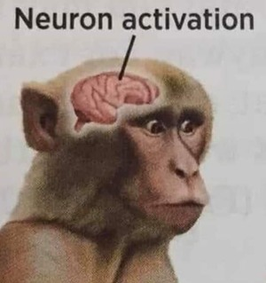

We do a lot of things in life, but have you ever wondered why? Sometimes we do, but sometimes we don't. Why do we do it? Why not?

## Disclaimer!

No thorough research went into it. You can consider this as something purely vomitted out by my brain without much thought or correction, but only based on pure experience and the correlations b/w them.

If you disagree with anything, take it out with my brain, not me. 🤓

But, hey isn't my brain actually just "me"? Why am I refering to myself in third person if the brain is literally me?
What if the brain is actually me and the rest of the organs are just a suite that my brain wears.

Just like how we think a CPU is the brain of a computer...

But can we really compare our brain to a computer CPU?

Because we can easily switch out a CPU in a computer for better performance, but can we do that to humans?
Maybe we can or cannot, so far I haven't seen anyone do it successfully.

[For the nerds: Yaa, I know switching out CPUs left and right isn't totally true for all scenarios, and of course I also know you can't just put an AMD chip on a LGA 1200, 1700 motherboard, so don't come at me saying "erm akshually 🤓☝️ ..."] 

But even if someone were to do that, i.e move a brain from body A to body B, does Body B now become body A?

These ideas have been executed in a lot of different ways in fictional media, but we'll have to wait and see how this plays out IRL...

Now, why did I talk about brains? Nevermind, let's move on..

Have you ever thought about "why" ?

"Why do certain stuff happen in a certain way possibly at certain time and when certain conditions are met?"

Now that's a lot of "certain".. But seriously, why?

Why are we able to perform breathing without explicitly trying to do so?

Why do Pizzas come in square boxes instead of a circular circle?

Why are buildings called "buildings" when they are already built ?

Why is the word "weird" pronounced weirdly? Apparently "wierd" is the wrong spelling 🙄..

And etc.. (ngl, I stole some of those above from somewhere else I read in the past, hehe.)

## why?

When does a human realise the concept of "why" for the first time?
Does this realisation sprout subconciously as we grow or something external trigger this?

Let me share one very early experience I remember that strongly made me think about why for almost whatever I observed.

### Voluntary
(This is embarrasing 🙈, just FYI.)

When I was like around 5-6 yrs old, I watched cartoons (obviously). And those cartoons are full of colors and magic. 
I used to think that whatever the world I'm living in was also made of magic. 

Why did I think this or what observation made me believe this?

At that time, I knew what marriage/wedding was. (Yes I knew, I remember going with my parents to some weddings even at that time).
Now the one thing I did not know was how when a man and a woman marry, they get a child.

This was very puzzling to me at that time when I was around ~6 yrs old.

Different cultures follow different rituals to codify their marriage. I knew this at that time through movies.
Some have rings, some have necklaces etc..

So I made the connection and came to the conclusion that something divine/magical was responsible for giving a baby human in 
the hands of the couple. And that magic which produces the baby is activated when the artifacts (rings, necklaces etc..) are exchanged and infused with magic by the guy who performs the marriage ritual.

I genuinely used to think this is the reason and that must also be why people pray to gods, why cartoons have the concept of magic in them etc..

Well . . . . that turned out to be a complete failure of a hypothesis and the "why" was constructed solely based on my observations/interpretations alone and did not involve input from others at all.

Also I did not brainstorm this further when I was 6 yrs old to see how this would play out if we marry inanimate objects and several other scenarios (which I can't talk about for obvious reasons) etc..etc...

So essentially it was this 👇

Well, at least one assuring thing is I did not blabber about this to anyone until this exact moment and have kept this memory within me for almost 16 years.

I would consider this as a voluntory thought on the reasoning of why.

Now let's find anything where the "why" comes out subconciously..

### Involuntary

I believe these will start to happen even before we learn to speak, reason with.
Something so deeply rooted, almost all organisms may exert this.

A reasoning of "why" where our body does most of the work with little involvment of brain.

I mean reflexes. Particularly Involuntary reflexes.

An involuntary reflex is a rapid, automatic response to a stimulus that does not require conscious thought.

One time I got my back burnt by playing hide and seek with my brother when I was 4-5 yrs old. My dad ironed his clothes and put the ironbox somewhere where we would not normally go and reach.

But we were playing hide and seek and I was exactly trying to hide where the ironbox was present. Without realising I pressed against it and got myself burned bad. To this day I still have the scar.

There was another incident involving fire. When you kick the ashes that are produced after burning something, they kinda look like explosions in movies. I kinda have some weird imaginations where I like to imagine how the ashes spread in the air when I kick it as hugh explosions.

Well you can already see where this is going. One day I saw a giant pile of ashes (after someone has burnt something). I ran to it faster and without thinking, I kicked it. But there was still idle fire under those ashes and burnt myself pretty bad.

I guess actions like this where you get hurt will automatically teach your brain and your muscles why it is bad to expose yourself to that substance. See, you don't have to really think hard about why this is happening, your body instictively knows it is bad after experiencing it and your body will try to move away even involuntarily. I used to get myself physically hurt almost every week when I was just a lil boy.. These days it's almost none. I don't even remember the last time I got physically hurt..

But are there stuff which are involuntary but cannot be reasoned with to understand why?

One thing I can think of which almost everyone experiences is Love.

Why do we feel good (or weird) when we see that certain someone?

erm akshually there's a word for it. It's called "attraction". 🤓☝️

But doesn't it have to be both sides?
There are cases where one person is attracted and the other does not feel the same.

If you're a normal organism beloning to the species of *homo sapiens* you'd have experienced it. I don't know about other species because I ain't one of em.

I've had my fair share of experience but I'm kind of shy to talk about it. I don't know who's gonna read it. So it's best to keep my experiences minimal 😅

There's a difference b/w having a crush and loving a person.

I have a crush on a lot of people. But I don't really feel anything long lasting, I don't think about them until I see them. I stop thinking about them almost immediately.

I would classify this as an attraction that is solely based on some logic and how we view the world through our "lens". When we are born, we grow up in a community of people, we interract with them or their creations almost daily and our worldview is built on those interractions as foundation. Be it how we dress, culture, religion, the way one thinks, morals, ethics etc.. What one man considers normal may be very weird to someone else.

I don't think I'd have to even provide an example for this.

So, based on the criteria of what is considered attractive of the opposite gender, we feel slightly attracted to another person that seem to satisfy that criteria. For example, having fair skin, lean body may be two of many positive criteria for a community. For some it may be how rich that person is or how overspoken they are.

People of same community will have common criteria that may or may not match or have commonality of some criterias with other communities. Our entire wordlview is based on what we are exposed to (the data that is fed into us) and how we correlate different data and reason with it.

What about love?

To me, it is something that makes you feel weird, have different emotions when you see, interract, or even think about them.
What do I mean "weird"? It is also another way of saying "I don't know the 'what' nor the 'why'".

But some symptoms include,

You feel something missing when you don't see that person.
You feel depressed/sad when they don't give you attention.
Your fluency of words generated for a conversion aren't as smooth when you're talking to that person.
You start to make up scenarios in your head.
You might have dreams that include them because you're thinking about them too much.

And many more.. These are what I believe most people will have in common.

Why does this happen?
This seems to be mixture of initiation by physical appearance, interraction and their behavior. And the interraction does not even have to be face to face. 

But does love start the exact moment you see them or after certain interval or an action by the target that triggers it. 
Likewise, does the love fade away after being in love with them due to certain triggers?

Both seem to happen after certain intervals based on what I observed.

For example, I'll share one of my experience.

During my school days, I used to talk to a girl in my class very frequently, I did not have any feelings, I just talk to her almost every day about literally random things, we play together, study together, have fun together.

But on a random day, I started having feelings for her, started avoiding her, feeling weird when I see her, I turn away when she notices that I was looking at her and not feeling good when she's absent etc..

Why did this happen suddenly and not at the start itself?

One hypothesis is, these all happened during my early teenage years. But this still doesn't explain why this sudden change out of nowhere. I will not mention what happened at the end tho, it is not important.

And for the opposite case, it could possibly be explained by the fact people divorce their partners (maybe ?) I don't have experience on this tho. 😂

The difference is, I've only had the feeling of love with just three people my whole life till now if I go by my own definition. But I've had countless crushes.

